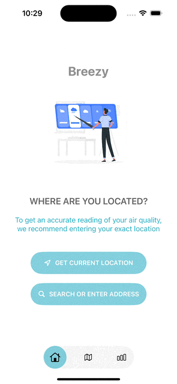
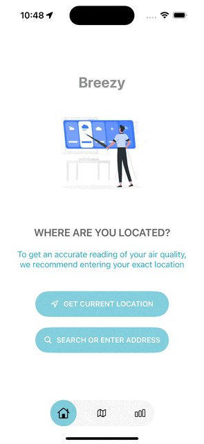

## Introduction
Breezy keeps you informed about the air you breathe with real-time air quality data. Whether you're planning your day, exercising outdoors, or concerned about pollution, Breezy helps you make informed decisions with up-to-the-minute AQI updates. It's built entirely in SwiftUI, making it fast, lightweight, and easy to use !

## Features:

### Content views:

  
  
  

- **User-Friendly Interface:** Easy-to-use and simple interface with smooth navigation and custom navigation bar  
- **Real-Time Location-Based AQI:** Fetches your current location and displays the AQI with detailed pop-over pollutant information   
- **Historical Data:** View air quality trends with historical data by week, month, and year
- **Pollutant Breakdown:** Detailed breakdown of six major key pollutants: PM2.5, PM10, NO2, O3, CO, and SO2
- **Interactive Map View:** Fully viewable map with AQI annotations and searchable features, allowing you to explore air quality in different areas
- **Clickable Annotations** Instantly access air quality index (AQI) and location details by tapping on map annotations." 
- **Search Functionality:** Search for air quality information in any location around the world  
---

##### App design, architecture, and design considerations:
- MVVM architecture 
- MapKit + CoreLocation to configure user location permissions, user location coordinates, georeversing, and map annotations
- MKLocalSearch + MKLocalSearchCompleter for searching locations 
- Protocol oriented programming - allows dependency injection and easily switch between real and mock for testing
- Extensions in model with mock data for testing
- Generics - used generics for working through @Bindable and in protocols
- Charts for viewing historical data by day, week, and months

##### Design issues I faced:
- Ran into a few errors with trying to use @Environment in a parent view, then passing that to the child view which owns the view model and then injecting that into the view model. This is not allowed since the environment object is available when the body of the view is called
- Sharing an instance of location manager between two view models. Used a Singleton design as a result and then injected it into the view model via the initializer
- Bindable and Protocols - faced some strange issues using @Observable - referred to this stack overflow post: https://stackoverflow.com/questions/59503399/how-to-define-a-protocol-as-a-type-for-a-observedobject-property 
- Also https://tanaschita.com/20230807-migrating-to-observation/ was great to use to reference @Observable and SwiftUI data flow. Using @Observable, we go from @StateObject->@State and @ObservedObject->@Bindable
- SwiftUI seems to only allow one modal to be displayed at a time. Ran into a bug where my .sheet() and .popover() modals conflicted with each other, resulting in both not being displayed
- Popover() seems to also have a bug when tracking by value so I had to switch to a sheet view

##### Notes :
- Date formatter - .formatted() is incredibly useful for formatting dates. iOS 15+ introduced a new Formatter API via Date.FormatStyle (.dateTime) which makes working with Dates much easier than creating a new DateFormatter.
- Swift charts for modeling historical air quality
- Singleton + Dependency injection - https://stackoverflow.com/questions/55483541/how-to-use-the-singleton-pattern-in-conjunction-with-dependency-injection
- Generics in protocol (associatedtype/type alias), and using either generics or existential types (protocol as type. required to use "any" keyword in future Swift), and difference in performance
- Read about "some", "any", generics, and static/dynamic dispatch
- MapReader allows MapKit to read user taps and convert it to coordinates in iOS 17
- CoreLocationUI has an interesting new LocationButton feature
- https://stackoverflow.com/questions/14214741/xcode-environment-variables-not-present-during-archive/74254208#74254208 - tip on storing API key for acess outside of Xcode (test flight / appstore ex)
- Customized environment keys/keypath for allowing protocols-as-types to be passed via .environment()

##### Helpful resources:
- https://stackoverflow.com/questions/62552209/pure-mvvm-with-swiftui-corelocation - Reference for location manager via dependency injection into view model (service-oriented-architecture)
- https://stackoverflow.com/questions/51263128/how-should-i-use-mvvm-and-dependency-injection-when-i-need-to-fetch-a-controller - Great reference for dependency injection
- https://www.polpiella.dev/mapkit-and-swiftui-searchable-map/ - Learning how to build out the local searches
